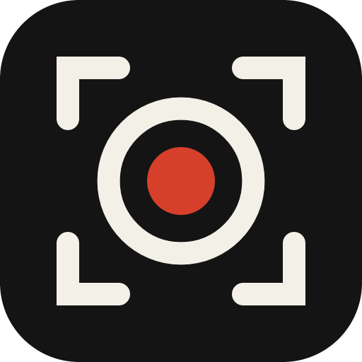
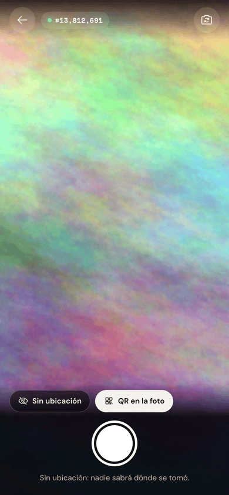
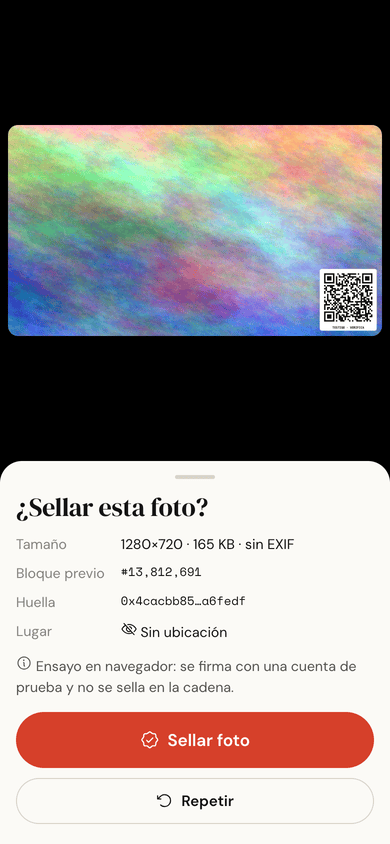
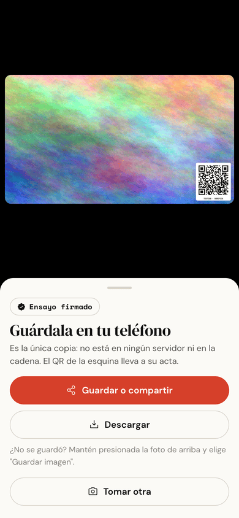
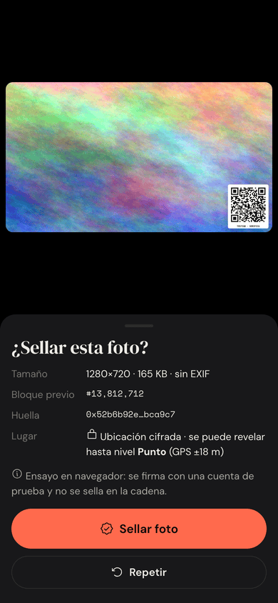
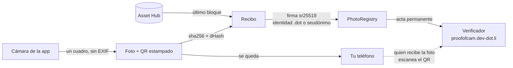

<div align="center">



# Proof of Cam

**Fotos con acta de nacimiento en Polkadot.**

Cada foto que tomas con Proof of Cam sale firmada por ti, anclada a un bloque de
Asset Hub y con un QR para verificarla. La foto se queda en tu teléfono: en la
cadena solo quedan sus huellas.


</div>

<p align="center">
  
  
  
  
</p>

---

## Qué es

Hay cada vez más imágenes alteradas o generadas con IA, y detectarlas después
es una carrera perdida. Proof of Cam va por el otro lado: le da a cada foto nueva un
**acta de nacimiento** verificable. Quién la tomó, cuándo y que no ha cambiado,
sin entregarle la foto a nadie.

Es un demo del stack de productos de Polkadot: corre dentro de Polkadot App (y
Polkadot Desktop), firma con la identidad `.dot` del usuario y registra en un
contrato de pallet-revive. Su nombre sigue a Proof of Talk, y es hermano de [testalk](https://github.com/w3nerick/testalk),
que hace lo mismo con charlas.

## Para qué sirve

- **Periodismo y reportes ciudadanos**: probar que una foto existía, sin exponer a quien la tomó.
- **Evidencia de eventos**: la foto lleva su QR; quien la vea en redes sabe quién la tomó y cuándo.
- **Seguros, peritajes, avance de obra**: fecha probada por la cadena y ubicación revelada solo a quien toca.
- **Derechos humanos**: seudónimo y ubicación apagada.
- **Fact-checking con Firefly**: evidencia fotográfica firmada por humanos verificados.

¿Es viable, qué falta probar y cómo se compara con ProofMode, Capture o el Pixel 10?
En [`docs/viabilidad.md`](docs/viabilidad.md).

## Documentación

| Documento | Qué explica |
|---|---|
| [`docs/firma-y-cuentas.md`](docs/firma-y-cuentas.md) | Cuenta de identidad y cuentas de producto: qué queda guardado al firmar, cómo se comprueba el nombre |
| [`docs/privacidad.md`](docs/privacidad.md) | Qué sale del teléfono, ubicación por niveles, contra quién protege y contra quién no, uso sensible |
| [`docs/viabilidad.md`](docs/viabilidad.md) | Lo probado y lo pendiente con evidencia, límites, usos, comparación y plan |

## Cómo funciona



1. **Disparo.** La cámara se enciende dentro de la app y se apaga en el instante
   del disparo. El teléfono anota el último bloque finalizado de Asset Hub.
2. **Foto.** El cuadro pasa por un canvas (pierde cualquier EXIF) y se le
   estampa un QR con el enlace a su acta.
3. **Huellas.** sha256 del archivo (prueba igualdad exacta) y un dHash de 64
   bits (reconoce la foto después de que un chat la recomprima).
4. **Recibo.** Id, huellas, bloque, hora UTC y, si se quiso, la ubicación
   cifrada. Se firma con la identidad `.dot` o con la cuenta de la app.
5. **Sello.** El recibo entero va a `PhotoRegistry`: no caduca y no depende de
   Bulletin. La cadena pone la hora del sello.
6. **Verificación.** Quien recibe la foto escanea el QR, o la suelta en
   `#/verificar` aunque haya perdido el QR. Su copia se compara en su navegador;
   no se sube.

## Privacidad

| Qué | Dónde |
|---|---|
| La foto | Solo en el teléfono de quien la tomó. Nunca se sube |
| Huella exacta y huella visual | Contrato en Asset Hub, permanente |
| Firma, bloque previo, hora UTC | Contrato |
| Nombre | Username `.dot` comprobado en People chain, **o nada** (modo seudónimo) |
| Ubicación | Apagada por defecto. Si se activa: cuatro compromisos y el geohash cifrado; el dueño revela un nivel a la vez |
| Resolución, cámara, modelo de teléfono, sistema, zona horaria, EXIF | En ningún lado |

La llave de la ubicación no se guarda: el host la deriva de la cuenta del
usuario para esta app (`deriveEntropy`, RFC 0007). Detalle y modelo de amenazas
en [`docs/privacidad.md`](docs/privacidad.md).

## Principios

**Cypherpunk.** "La privacidad es el poder de revelarse al mundo de forma
selectiva" (Hughes, 1993). Aquí eso es literal:
- **Revelar solo lo necesario.** La foto la muestra quien quiere. La ubicación
  se revela por niveles y solo por su dueño. El recibo lleva lo justo para
  verificar.
- **Anonimato posible.** Se puede firmar con un seudónimo que nadie liga a tu nombre.
- **Sin terceros de confianza.** No hay servidor. La firma se verifica en el
  navegador de quien mira y los bloques en la cadena. El contrato no tiene dueño
  y nadie puede borrar un acta.
- **Código que se puede auditar.** Licencia MIT, y el deploy se compara byte
  por byte con el build (`npm run check-deploy`).

**La visión de Polkadot.** Es un *producto* dentro del *host* (la arquitectura
Triangle):
- Firma con la identidad de Polkadot App: sin extensiones y con las llaves en el
  teléfono.
- Lee la cadena por el cliente ligero del host.
- Deriva sus llaves con `deriveEntropy` (RFC 0007), sin guardar secretos.
- Pide permisos solo al usarlos (RFC 0002).
- Vive en un nombre `.dot` y registra en Polkadot Hub (pallet-revive).
- "Hacer que lo correcto sea lo fácil": el usuario toma una foto; la criptografía
  no se ve.

Lo que falta para cerrar los huecos (alias de persona única con Individuality y
pagos sin rastro con Coinage) está en [`docs/privacidad.md`](docs/privacidad.md).

## Qué prueba y qué no

**Prueba** quién la tomó (firma y People chain; ver [cómo se firma](docs/firma-y-cuentas.md)), que no existía antes del bloque
previo ni después del bloque del sello, que no cambió ni un píxel, y que salió de
la cámara de la app: aquí no se puede sellar una foto de la galería.

**No prueba** que la escena sea real: una foto de una pantalla con una imagen
hecha por IA también queda firmada (el "agujero analógico", que tampoco resuelven
C2PA, Leica ni el Pixel 10). La ubicación la declara el teléfono. Y no dice nada
de fotos que no se tomaron aquí: es un acta de nacimiento, no un detector. Y el
seudónimo esconde tu nombre pero no te hace anónimo ([contra quién protege](docs/privacidad.md#contra-quién-protege)).

## Estructura

```
proofofcam/
├── app/                      Interfaz (se publica en proofofcam.dot)
│   ├── src/lib/
│   │   ├── camera.ts         getUserMedia, un cuadro y apagado inmediato
│   │   ├── photo.ts          QR estampado, JPEG, huellas, detección de EXIF
│   │   ├── imagehash.ts      sha256, dHash, comparación y huellas débiles
│   │   ├── loc.ts            Ubicación: compromisos por nivel, cifrado, pruebas
│   │   ├── geohash.ts        Coordenadas → celdas, sin servicios externos
│   │   ├── geo.ts            GPS y llave derivada (deriveEntropy)
│   │   ├── receipt.ts        Recibo canónico y verificación de firma
│   │   ├── registry.ts       PhotoRegistry: leer, simular y sellar
│   │   ├── signer.ts         Identidad .dot, seudónimo o ensayo
│   │   └── save.ts           Compartir, descargar
│   ├── src/views/            Inicio, cámara, acta, buscador, diagnóstico
│   └── test/                 Pruebas de las piezas puras (node --test)
├── contract/                 PhotoRegistry: Solidity → PolkaVM (resolc)
│   ├── contracts/PhotoRegistry.sol
│   ├── scripts/deploy.mjs    Simula, pide la semilla sin eco, firma solo con DESPLEGAR
│   └── test/                 Lógica en EVM local
└── docs/
```

## Desarrollo

```bash
cd app && npm install
npm test          # ids, geohash, huellas, ubicación y recibo
npm run dev       # fuera de Polkadot App entra en modo ensayo: firma una cuenta de prueba y no sella
npm run verify -- <id> [foto.jpg]   # verifica un acta sin la app: firma, identidad, bloque y archivo
```

```bash
cd contract && npm install
npm run build     # resolc (PolkaVM) + solc (ABI y EVM)
npm test          # lógica del contrato en EVM local
npm run simulate  # instancia el bytecode real contra el devnet, sin firmar
```

## Deploy

1. **Contrato** (una vez, en Terminal.app): `cd contract && npm run deploy`.
   Pide la frase semilla sin mostrarla, simula desde tu cuenta (depósito ~1.39
   PAS) y solo firma si escribes `DESPLEGAR`. La dirección queda en
   `contract/deployments.json`: copiarla a `REGISTRY_ADDRESS` en
   `app/src/lib/network.ts`.
2. **App** (en Terminal.app): `cd app && npm run deploy` → `proofofcam.dot` y
   `https://proofofcam.dev-dot.li`. Después, `npm run check-deploy`.
3. **Probar el teléfono**: abrir `proofofcam.dot/#/diagnostico` en Polkadot App
   y copiar el reporte.

## Lo que se sabe de la plataforma (28 sep 2026)

- **iPhone: probado.** El 28 sep 2026 se tomó y selló la primera foto desde
  Polkadot App en iOS (acta `ckaaqtce3u7gukpz`): el host habla el códec 1 y
  la cámara, la firma y el contrato funcionan. La descarga con `<a download>`
  **no** sirve ahí (abre la imagen encima de la app); se guarda compartiendo
  o manteniendo presionada la foto.
- **Cámara en Android:** `getUserMedia` funciona dentro del producto
  ([products-devnet-issues #7](https://github.com/Polkadot-Community-Foundation/products-devnet-issues/issues/7)).
- **Ubicación:** en Android falla sin preguntar (#7, abierto; el WebView del host
  no implementa `onGeolocationPermissionsShowPrompt`).
- **Selector de archivos:** la app Android lo implementó el 26 sep 2026 y ofrece
  la cámara nativa, "igual que iOS". Proof of Cam no lo usa para sellar porque también
  deja elegir fotos de la galería.
- **Protocolo:** la app habla el códec 1 (product-sdk-host 0.19.1), el de
  Polkadot Desktop 0.1.3. El códec 2 no es compatible con el 1 (RFC 0027); si un
  teléfono ya lo habla, el diagnóstico lo muestra como "no llegó a connected".

## Trabajo relacionado

[ProofMode](https://guardianproject.info/apps/org.witness.proofmode/) (Guardian
Project y WITNESS), [Capture / ProofSnap](https://captureapp.xyz/) (Numbers
Protocol) y las Content Credentials C2PA del
[Pixel 10](https://blog.google/security/pixel-android-trusted-images-c2pa-content-credentials/)
firman fotos al tomarlas. Proof of Cam aporta una identidad humana legible (un
username `.dot`, no una llave suelta), no pide instalar nada, vive dentro del
wallet y se verifica con un QR en cualquier navegador.

## Licencia

MIT
